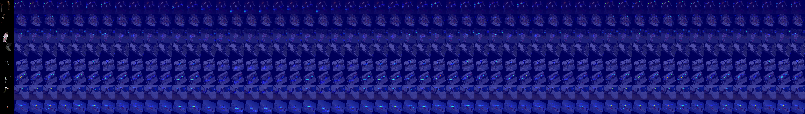
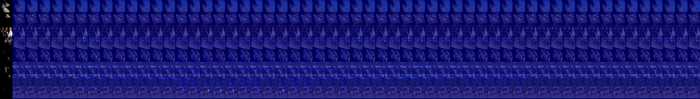

# master-thesis

# Output of the network

# Note
- Use different loss, e.g. [focal loss](https://github.com/clcarwin/focal_loss_pytorch/blob/master/focalloss.py), or [something simlar to focal loss](https://github.com/xingyizhou/CenterNet/blob/8ef87b433529ac8f8bd4f95707f6bc05052c55e9/src/lib/models/losses.py) 
- After joints got affined transformed, some of the transformed joints are out of the picture
